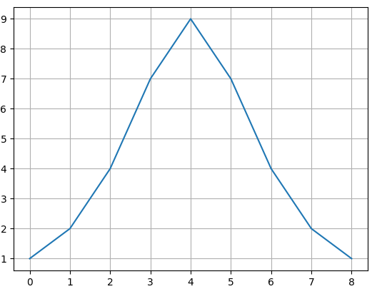

Начальная теория
---

Генеральная совокупность(ГС) - совокупность всех объектов (единиц), относительно
которых предполагается делать выводы при изучении конкретной задачи.

Выборка - это ограниченная по численности группа объектов, которую мы выбираем 
из генеральной совокупности.

Не всегда есть возможность изучить свойства ГС, попросту нет возможности посчитать
все ее элементы, для этого создают так называемую Выборку, выборка это часть элементов 
из генеральной совокупности, вместо того что бы исследовать всю ГС мы исследуем только 
выборку, небольшую часть, а далее предполагаем что вся ГС обладает свойствами этой выборки.

Для чистоты эксперимента требуется чтобы выборка была репрезентативной, то есть 
небольшое число выбранных объектов имела те же свойства и в той же пропорции, что и ГС.

Типы выборок: 

1) Выборка в слепую - все элементы выборки выбираются в слепую.
2) Стратифицированная выборка - с начала ГС разбивается на группы по свойствам, скажем
по полу, или цвету, а после из каждой группы выбираем одинаковое количество элементов.
3) Групповая выборка - разбиваем ГС на группы, но группа не будет сгруппирована по 
какому-либо признаку, каждая группа будет похожа др на др, а далее мы выбираем из них
элементы, в качестве примера это разделение города на участки.

---

Типы переменных:

1) Количественные:
    - непрерывные - данные могут принимать люб знач на некотором промежутке, это 
   диапазон чисел, скажем от `[150 ; 190]`
    - дискретные - данные принимают точные значения, к примеру количество детей в семье
    

2) Номинативные - это деление данных на группы, где цифры выступают в качестве маркеров
не более, к примеру под `1` будем подразумевать всех людей мужского пола, а под `2` 
всех женщин.

---

Для описания данных и того как они распределены, используются 2 метода, это
`Меры центральных тенденций` и `Меры Изменчивости`

>Меры центральных тенденций - это набор чисел для описания частоты появления данных, 
>и описания центра распределения графика.
>
>Типы центральных тенденций:
>1) Мода
>2) Медиана
>3) Среднее арифметическое

>Меры Изменчивости - это набор чиcел, для описания изменчивости наших данных, того как
> они могут быть разнообразными.

---

Центральная тенденция - Мода
---

>**Мода (moda)** - такое значение признака которое встречается наиболее часто, то есть
>элемент из набора данных который встречается чаще всего.

На гистограмме, по вертикале, расположена частота появления данных, по горизонтали
расположена шкала измеряющая их значение.

На гистограмме мода выражена как самая высокая точка на графике, то 
есть в данном случае это будет верхняя точка, то есть число `4`
ибо оно встречается в наборе данных `9` раз. 



```python
import matplotlib.pyplot as plt

y = [1, 2, 4, 7, 9, 7, 4, 2, 1]

plt.plot(y)

plt.grid()
plt.show()
```

Данные графика так же можно представить как набор значений, в числовом выражении
мода это то число, что встречается чаще всего.
```python
import numpy as np

mass = [
    185,175,170,169,171,172,175,157,170,172,167,173,168,167,166,
    167,169,172,177,178,165,161,179,159,164,178,172,170,173,171
]

values, counts = np.unique(mass, return_counts=True)

print('Все значения = ', values)
print('Количество раз что они встречаются = ', counts)

index = np.argmax(counts)

print('Самое часто встречающееся число = ', values[index])
print(f'Число {values[index]} встречается {counts[index]} раз')

# Вывод :
# Все значения =  [157 159 161 164 165 166 167 168 169 170 171 172 173 175 177 178 179 185]
# Количество раз что они встречаются =  [1 1 1 1 1 1 3 1 2 3 2 4 2 2 1 2 1 1]
# Самое часто встречающееся число =  172
# Число 172 встречается 4 раз
```

---

Центральная тенденция - Медиана
---

>**Медиана (median)** - значение признака, которое делит упорядоченное множество
>данных пополам.

К примеру у нас есть набор данных, упорядочим его по возрастанию,
тогда медиана будет таким значением признака который делит это
множество данных по полам, то есть это будет число что находится 
посередине этого набора данных.

Тут есть 2 варианта:

1) Набор данных может быть не четным, тогда медиана это среднее число
из списка
```python
import numpy as np

# не отсортированный список
data = [161, 164, 157,  167, 167, 159, 165, 166, 167]

# сортируем список
data.sort()

# numpy метод для вычисления медианы
median = np.median(data)

print('Элемент из середины списка, Медиана равна = ', median)

# Вывод
# Элемент из середины списка, Медиана равна =  165.0
```

2) Набор данных может быть четным, в таком случае мы находим `2` числа,
что находятся посередине и находим среднее от них

```python
import numpy as np

# не отсортированный список
data = [161, 164, 157, 166, 167, 167, 159, 165, 166, 167]

# сортируем список
data.sort()

# numpy метод для вычисления медианы
median = np.median(data)

print('Элемент из середины списка, Медиана равна = ', median)

# Элемент из середины списка, Медиана равна = 165.5
# (165+166)/2 = 165.5
```
---

Центральная тенденция - Среднее значение
---

> Среднее значение (mean, среднее арифметическое) - сумма всех значений измеряемого
> признака, деленная на количество измеренных значений.

Посчитаем сами и используем модуль `numpy` для этого :
```python
import numpy as np

# не отсортированный список
data = [161, 164, 157, 166, 167, 167, 159, 165, 166, 167]
mean = 0

for elem in data:
    mean += elem

print('Сумма элементов = ', mean)
print('Количество элементов = ', len(data))
print('Среднее арифметическое своим счетом = ', mean/len(data))

print('Среднее арифметическое с помощью numpy = ', np.mean(data))

# Вывод 
# Сумма элементов =  1639
# Количество элементов =  10
# Среднее арифметическое =  163.9
# Среднее арифметическое np.mean =  163.9
```
Различают 2 средних значения, среднее от выборки и среднее от генеральной совокупности.

---

Меры центральных тенденций, находятся приблизительно рядом, все зависит от данных,
если диаграмма, симметрична относительно центра, 
бимодальна(то есть имеет только одну моду, один пик на графике) и подчиняется 
нормальному(Гауссовскому) распределению, то все три меры центральных тенденций,
мода, медиана и среднее будут совпадать. 

---


