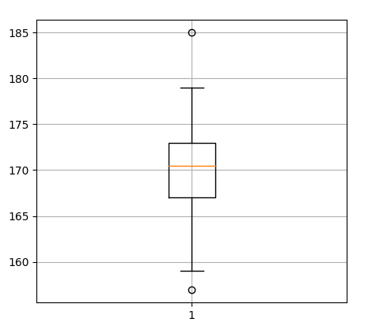

Квантили распределения и Квартили
---
Квартили - три таких точки(значения из набора данных), которые делят упорядоченное
множество данных на четыре части.

`np.array_split` - делит массив на равные или почти равные части, на указанное
количество частей.

```python
    import numpy as np

    array = [
        185, 175, 170, 169, 171, 172, 175, 157, 170, 172, 167, 173, 168, 167, 166,
        167, 169, 172, 177, 178, 165, 161, 179, 159, 164, 178, 172, 170, 173, 171
    ]

    result = np.array_split(, 4)

    print('result = ', result)

    # Вывод     
    #  result =  
    #  [array([185, 175, 170, 169, 171, 172, 175, 157]), 
    #  array([170, 172, 167, 173, 168, 167, 166, 167]), 
    #  array([169, 172, 177, 178, 165, 161, 179]), 
    #  array([159, 164, 178, 172, 170, 173, 171])]
```

Квартили распределения удобно просматривать на таком типе графиков как `Box plot` 
или как его еще называют, ящик с усами, используем `matplotlib` что бы показать
его на графике.



Можно увидеть что `box plot` хорошо подходит хорошо, подходит что бы показывать
квартили, квартили делят все данные на 4 части и это хорошо видно на графике, так 
же `box plot` хорошо подходит что бы показывать существующие выбросы, они помечены 
точками как вверху, так и внизу графика.

```python
    import matplotlib.pyplot as plt
    
    array = [
        185, 175, 170, 169, 171, 172, 175, 157, 170, 172, 167, 173, 168, 167, 166,
        167, 169, 172, 177, 178, 165, 161, 179, 159, 164, 178, 172, 170, 173, 171
    ]

    plt.boxplot(array)

    plt.grid()
    plt.show()
```


